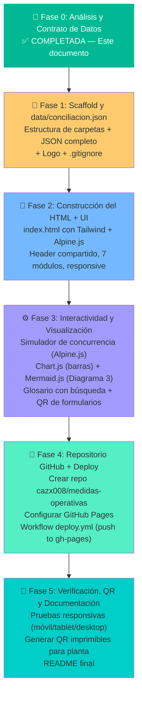

# 🏭 Plan de Implementación: Portal Web "Medidas Operativas"

**Proyecto:** `medidas-operativas`  
**Repositorio GitHub:** `cazx008/medidas-operativas`  
**URL destino:** `https://cazx008.github.io/medidas-operativas/`  
**Versión del Plan:** v0.1.0  
**Fecha:** 2026-08-24  
**Estándar:** DocSemVer v1.0.0  

---

## 1. Definición y Propósito

### ¿Qué es?

Un **portal web estático, público y responsivo** que transforma el "Documento Marco de Conciliación y Corresponsabilidad Bilateral" (actualmente un PDF de 4 páginas y un MD de 222 líneas) en una **herramienta de consulta diaria** accesible desde cualquier celular de planta o PC de oficina.

### ¿Qué NO es?

- No es un dashboard de datos en tiempo real (ese es `sanesca-dashboard`).
- No consume la API de Notion en runtime ni en build.
- No requiere servidor, base de datos ni autenticación.

### Relación con el Dashboard de Actualidad (`sanesca-dashboard`)

Ambos proyectos son **páginas hermanas** del ecosistema web de Sanesca que se enlazan mutuamente:

```
┌──────────────────────────────────┐     ┌──────────────────────────────────┐
│    sanesca-dashboard             │     │    medidas-operativas            │
│    ⚡ Monitoreo Operativo        │◄───►│    🏭 Medidas Operativas         │
│                                  │     │                                  │
│  Countdown en vivo               │     │  Principios de convivencia       │
│  Probabilidad del día            │     │  Simulador de concurrencia       │
│  Tarjetas semanales              │     │  Cadena crítica interactiva      │
│  KPIs mensuales                  │     │  Pacto bilateral                 │
│  Datos: Notion API (cron)        │     │  Hub de formularios              │
│  ──────────────────              │     │  Glosario con búsqueda           │
│  [Header] → enlace a medidas     │     │  [Header] → enlace a dashboard   │
└──────────────────────────────────┘     └──────────────────────────────────┘
```

**Patrón de navegación:**  
- El header de `sanesca-dashboard` tiene un enlace ☰ que lleva a `medidas-operativas`.
- El header de `medidas-operativas` tiene un enlace ☰ que lleva a `sanesca-dashboard`.
- Ambos headers comparten el mismo layout visual (logo + título + menú) con diferente título y color de acento.

---

## 2. Anatomía de la Aplicación (7 Módulos)

```
┌──────────────────────────────────────────────────────────────────────────────┐
│  ZONA 0: HEADER (idéntico al de sanesca-dashboard en layout)               │
│  [Logo Sanesca]    🏭 Medidas Operativas    [⚡ Dashboard ↗] [☰ Menú]      │
├──────────────────────────────────────────────────────────────────────────────┤
│                                                                              │
│  ZONA 1: HERO CONTEXTUAL                                                    │
│  ┌────────────────────────────────────────────────────────────────────────┐  │
│  │  🚦 Indicador del Día: "Hoy es Lunes · 72% probabilidad de corte"    │  │
│  │  ⏰ Franja Dorada activa: 06:00 – 11:00 AM │ ⚠️ Ventana Riesgo: 12:28 PM │
│  └────────────────────────────────────────────────────────────────────────┘  │
│                                                                              │
│  ZONA 2: NAVEGACIÓN INTERNA (sticky en scroll)                              │
│  [ 🎯 Principios ] [ 📊 Estadística ] [ ⚙️ Máquinas ] [ 🔗 Flujo ]        │
│  [ 📋 Pacto ] [ 📱 Formularios ] [ 📖 Glosario ]                            │
│                                                                              │
├──────────────────────────────────────────────────────────────────────────────┤
│                                                                              │
│  MÓDULO 1: PRINCIPIOS DE CONVIVENCIA                                        │
│  3 tarjetas expandibles con los principios fundamentales                    │
│  (Aproximación Falsificable · Corresponsabilidad Real · Protección)         │
│                                                                              │
├──────────────────────────────────────────────────────────────────────────────┤
│                                                                              │
│  MÓDULO 2: SEMÁFORO ESTADÍSTICO Y FRANJA DORADA                            │
│  ┌─ Gantt Interactivo ─────────────────────────────────────────────────┐    │
│  │  06:00 ████████████ 11:00 ░░░░░░░░░░░░░░░░░ 16:30 ██████ 18:00    │    │
│  │  🟢 FRANJA DORADA         🔴 VENTANA RIESGO         🟡 RETORNO     │    │
│  └─────────────────────────────────────────────────────────────────────┘    │
│  ┌─ Tabla Estadística ──────────────────────────────────────────────────┐   │
│  │  Día    │ Cortes │ %Total │ Prob.  │ Ventana          │ Duración    │   │
│  │  Mié    │ 15     │ 24.2%  │ 83% ■  │ 11:53–04:15 PM  │ 4h 22m      │   │
│  │  Lun    │ 13     │ 21.0%  │ 72% ■  │ 12:28–05:05 PM  │ 4h 36m      │   │
│  │  ...    │        │        │        │                  │             │   │
│  └─────────────────────────────────────────────────────────────────────┘    │
│  ┌─ Gráfico de Barras (Chart.js) ─────────────────────────────────────┐    │
│  │  Probabilidad de corte por día de la semana                        │    │
│  └─────────────────────────────────────────────────────────────────────┘    │
│                                                                              │
├──────────────────────────────────────────────────────────────────────────────┤
│                                                                              │
│  MÓDULO 3: SIMULADOR DE CONCURRENCIA DE MAQUINARIA                          │
│  ┌────────────────────────────────────────────────────────────────────────┐  │
│  │  Selecciona una máquina:  [ Corte Láser CNC          ▾ ]              │  │
│  │                                                                        │  │
│  │  ⚡ Resultado:                                                         │  │
│  │  Estado bajo generador: 🔴 RESTRINGIDO / EXCLUSIVO                    │  │
│  │  Operador: Gabriel Méndez                                              │  │
│  │  Regla: Debe concentrarse 100% en la Franja Dorada (06:00–11:00 AM)   │  │
│  │  con red pública comercial para evitar fallas electrónicas.            │  │
│  │                                                                        │  │
│  │  ⚠️ Incompatible con: Punzonadora (simultáneo), Horno Pintura (carga) │  │
│  └────────────────────────────────────────────────────────────────────────┘  │
│                                                                              │
│  ┌─ Vista de Tarjetas (7 estaciones) ─────────────────────────────────────┐ │
│  │ [Láser CNC] [Punzón.] [Plegad.] [Soldad.] [Compr.] [Horno] [Sierra]  │ │
│  └────────────────────────────────────────────────────────────────────────┘  │
│                                                                              │
├──────────────────────────────────────────────────────────────────────────────┤
│                                                                              │
│  MÓDULO 4: CADENA CRÍTICA Y FLUJO DE PRODUCCIÓN                            │
│  ┌─ Diagrama Mermaid Interactivo (Diagrama 3 Corregido) ──────────────┐    │
│  │  [S1: Dirección] → [S_ALM: Almacén] → [S2: Mecanizado]            │    │
│  │  → [S3: Transformación] → [S4: Pintura/Horno] → [S5: Salida]      │    │
│  └─────────────────────────────────────────────────────────────────────┘    │
│  ┌─ Timeline Interactivo: Hitos por Día de la Semana ─────────────────┐    │
│  │  Vie→Lun: Planos | Lun-Mié: Corte | Lun-Jue: Herrería             │    │
│  │  Mié-Jue: Pintura | Jue-Vie: Embalaje | Vie: Despacho             │    │
│  └─────────────────────────────────────────────────────────────────────┘    │
│                                                                              │
├──────────────────────────────────────────────────────────────────────────────┤
│                                                                              │
│  MÓDULO 5: PACTO BILATERAL (TALLER ↔ GERENCIA)                              │
│  ┌────────────────────────────┬───────────────────────────────────────────┐  │
│  │ 🔧 Aportes del Taller     │ 🏢 Garantías de la Gerencia              │  │
│  │                            │                                           │  │
│  │ 1. Puntualidad Dorada     │ 1. Blindaje de Planos y Materiales       │  │
│  │ 2. Bloques Concurrencia   │ 2. Gestión Proactiva de Diésel           │  │
│  │ 3. Notificación de Avance │ 3. Estabilidad en Prioridades            │  │
│  │ 4. Colaboración Diagnóst. │ 4. Facilitación de Transporte            │  │
│  └────────────────────────────┴───────────────────────────────────────────┘  │
│                                                                              │
├──────────────────────────────────────────────────────────────────────────────┤
│                                                                              │
│  MÓDULO 6: HUB DE FORMULARIOS DE DIAGNÓSTICO                               │
│  ┌──────────────────┐ ┌──────────────────┐ ┌──────────────────────────┐     │
│  │ 📱 F1: Censo de  │ │ ⏱️ F2: Tiempos  │ │ ⛽ F3: Combustible       │     │
│  │ Movilidad        │ │ y Capacidad      │ │ de Planta               │     │
│  │                  │ │                  │ │                          │     │
│  │ Para: Todo el    │ │ Para: Operarios  │ │ Para: Gerencia, Almacén │     │
│  │ personal         │ │ de taller        │ │ y Encargados             │     │
│  │                  │ │                  │ │                          │     │
│  │ 16 preguntas     │ │ ~35 preg. con    │ │ 16 preg. exploratorias  │     │
│  │ secuenciales     │ │ branching ×6     │ │ sobre flujo de gasoil   │     │
│  │                  │ │                  │ │                          │     │
│  │ [📲 Abrir] [QR]  │ │ [📲 Abrir] [QR]  │ │ [📲 Abrir] [QR]         │     │
│  └──────────────────┘ └──────────────────┘ └──────────────────────────┘     │
│                                                                              │
├──────────────────────────────────────────────────────────────────────────────┤
│                                                                              │
│  MÓDULO 7: GLOSARIO TÉCNICO CON BÚSQUEDA INSTANTÁNEA                       │
│  🔍 [Buscar término...]                                                      │
│  • Franja Dorada — Ventana 06:00–11:00 AM con 100% de estabilidad          │
│  • Ventana de Riesgo — Franja 11:30–04:30 PM con 82.3% de cortes          │
│  • Concurrencia — Capacidad de encender máquinas sin sobrecargar           │
│  • Cadena Crítica — Secuencia donde un retraso frena los siguientes        │
│  • Tienda Completa — Pedido cerrado que libera bonos de productividad      │
│  • Embalaje — Protección, etiquetado y verificación QC                     │
│  • Prensa Plegadora CNC — Doblado entre corte y soldadura                  │
│                                                                              │
├──────────────────────────────────────────────────────────────────────────────┤
│  ZONA F: FOOTER                                                              │
│  Sanesca Exhibidores · Documento Marco v2.0 (Agosto 2026)                   │
│  Versión Web v0.1.0 · Hosted on GitHub Pages                                │
└──────────────────────────────────────────────────────────────────────────────┘
```

---

## 3. Contrato de Datos (`data/conciliacion.json`)

Toda la información del portal se alimenta de un único archivo JSON. Para actualizar la web basta con editar este archivo y hacer push.

```jsonc
{
  "meta": {
    "version": "2.0",
    "fecha_emision": "Agosto 2026",
    "empresa": "Sanesca",
    "facilitador": "Encargado de Datos / Jefe de Almacén",
    "periodo_observacion": "14 Abril – 18 Agosto 2026",
    "semanas_observadas": 18,
    "total_eventos": 62,
    "horas_generacion_acumuladas": 272.1,
    "generador": {
      "modelo": "Iveco Aifo GE 8031 I 06.05",
      "potencia_kw": 28.0,
      "potencia_kva": 35,
      "amperaje": 92,
      "rpm": 1800,
      "consumo_nominal_lh": 6.2
    }
  },

  "horario_laboral": {
    "lunes_viernes": "07:00 AM – 04:00 PM",
    "sabado": "07:00 AM – 12:00 PM",
    "franja_dorada": { "inicio": "06:00", "fin": "11:00", "confiabilidad": "100%" },
    "ventana_riesgo": { "inicio": "11:30", "fin": "16:30", "porcentaje": "82.3%" }
  },

  "estadistica_semanal": [
    { "dia": "Miércoles", "cortes": 15, "pct": 24.2, "prob": 83, "riesgo": "muy_alto", "ventana": "11:53 AM – 04:15 PM", "duracion": "4h 22m" },
    { "dia": "Lunes",     "cortes": 13, "pct": 21.0, "prob": 72, "riesgo": "muy_alto", "ventana": "12:28 PM – 05:05 PM", "duracion": "4h 36m" },
    { "dia": "Jueves",    "cortes": 12, "pct": 19.4, "prob": 67, "riesgo": "alto",     "ventana": "12:18 PM – 04:12 PM", "duracion": "3h 54m" },
    { "dia": "Martes",    "cortes": 11, "pct": 17.7, "prob": 61, "riesgo": "alto",     "ventana": "12:57 PM – 05:02 PM", "duracion": "4h 06m" },
    { "dia": "Viernes",   "cortes":  8, "pct": 12.9, "prob": 44, "riesgo": "medio",    "ventana": "11:06 AM – 03:57 PM", "duracion": "4h 52m" },
    { "dia": "Sábado",    "cortes":  3, "pct":  4.8, "prob": 17, "riesgo": "bajo",     "ventana": "11:00 AM – 04:20 PM", "duracion": "5h 20m" },
    { "dia": "Domingo",   "cortes":  0, "pct":  0.0, "prob":  0, "riesgo": "ninguno",  "ventana": "—",                   "duracion": "—" }
  ],

  "maquinaria": [
    {
      "id": "laser",
      "nombre": "Corte Láser CNC",
      "operador": "Gabriel Méndez",
      "estado_generador": "Restringido / Exclusivo",
      "badge": "restringido",
      "regla": "Exige alta potencia y estabilidad de onda. Debe concentrarse 100% en la Franja Dorada (06:00–11:00 AM) con red pública comercial para evitar fallas electrónicas.",
      "incompatible_con": ["punzonadora"]
    },
    {
      "id": "punzonadora",
      "nombre": "Punzonadora CNC",
      "operador": "Carlos Silva",
      "estado_generador": "No Simultáneo con Láser",
      "badge": "condicionado",
      "regla": "Se programa en ventanas alternas en la mañana; evitar el encendido simultáneo con el láser bajo generador para prevenir caídas de tensión.",
      "incompatible_con": ["laser"]
    },
    {
      "id": "plegadora",
      "nombre": "Prensa Plegadora CNC",
      "operador": "Operario asignado según lote",
      "estado_generador": "Programado / Alterno",
      "badge": "condicionado",
      "regla": "Utilizada activamente para doblado de piezas cortadas. Se programa en ventanas alternas con el láser; evitar concurrencia con punzonadora bajo generador.",
      "incompatible_con": ["punzonadora"]
    },
    {
      "id": "soldadura",
      "nombre": "Soldadura MIG (Herrería)",
      "operador": "Gustavo Méndez (Joan, Hermo, Renny)",
      "estado_generador": "Carga Parcial Permitida",
      "badge": "parcial",
      "regla": "Máximo 1 a 2 puestos de soldadura activos simultáneamente. Incompatible con el encendido de compresores de alta demanda de pintura.",
      "incompatible_con": ["compresores"]
    },
    {
      "id": "compresores",
      "nombre": "Compresores / Cabina Pintura",
      "operador": "Julio Daniel / Barbara / Janeth / Neuro",
      "estado_generador": "Carga Aislada Programada",
      "badge": "condicionado",
      "regla": "Solo si Herrería no tiene soldadura pesada en curso. Se recomienda asignar bloques exclusivos por horas para la aplicación de pintura.",
      "incompatible_con": ["soldadura"]
    },
    {
      "id": "horno",
      "nombre": "Horno de Pintura Electrostática",
      "operador": "Julio Daniel / Barbara / Janeth / Neuro",
      "estado_generador": "Consumo Masivo Exclusivo",
      "badge": "restringido",
      "regla": "Puede encenderse con la planta diésel, pero su altísima demanda térmica (~18–24 kW) bloquea el uso de casi cualquier otra máquina pesada durante el ciclo de horneado.",
      "incompatible_con": ["laser", "punzonadora", "soldadura", "compresores"]
    },
    {
      "id": "sierra",
      "nombre": "Sierra de Banco (Carpintería)",
      "operador": "Alí Torrealba / Wilfredo Bello",
      "estado_generador": "Bloques Notificados",
      "badge": "notificado",
      "regla": "Como contratistas autogestionados, deben notificar sus horas de corte los viernes para programar ventanas que no colisionen con herrería o pintura.",
      "incompatible_con": []
    }
  ],

  "cadena_critica": [
    { "paso": 0,   "nombre": "Diseño y Planificación",     "ventana": "Viernes 3:00 PM",            "responsables": "Javier Cardozo / Eduardo", "hito": "Planos, despieces y archivos de corte entregados" },
    { "paso": 1,   "nombre": "Mecanizado Primario",         "ventana": "Lun-Mié 06:00–10:30 AM",    "responsables": "Gabriel / Carlos Silva",   "hito": "Láser, Punzón y Plegadora transforman láminas" },
    { "paso": 2,   "nombre": "Transformación y Ensamble",   "ventana": "Lunes a Jueves",             "responsables": "Gustavo / Alí / Wilfredo", "hito": "Estructuras y muebles armados para Pintura" },
    { "paso": 3,   "nombre": "Acabado y Horneado",          "ventana": "Miércoles y Jueves",         "responsables": "Julio Daniel / Barbara / Neuro", "hito": "Pintura acumula carga para horno completo" },
    { "paso": 3.5, "nombre": "Embalaje y Verificación QC",  "ventana": "Jueves y Viernes",           "responsables": "Keyver / Yorvel",          "hito": "Protección, etiquetado, flejado y verificación" },
    { "paso": 4,   "nombre": "Despacho e Instalación",      "ventana": "Viernes Cierre",             "responsables": "Marvin / Arsenio",         "hito": "Tienda completa → bono semanal liberado" }
  ],

  "pacto_bilateral": {
    "taller": [
      { "num": 1, "titulo": "Puntualidad en Franja Dorada", "detalle": "Concentrar el 80% del corte y mecanizado crítico en las primeras 5 horas del día con luz comercial garantizada." },
      { "num": 2, "titulo": "Respeto a Bloques de Concurrencia", "detalle": "Acatar las reglas preliminares de la planta eléctrica; coordinar encendidos de horno o soldadoras sin sobrecargar el generador." },
      { "num": 3, "titulo": "Notificación de Lotes de Avance", "detalle": "Informar piezas terminadas acumuladas por tienda para que Pintura y Carpintería programen sus ciclos sin duplicar arranques." },
      { "num": 4, "titulo": "Colaboración con Diagnósticos", "detalle": "Participar en los formularios de recolección de información (Sección 6). Son herramientas de planificación compartida con datos reales." }
    ],
    "gerencia": [
      { "num": 1, "titulo": "Blindaje de Planos y Materiales", "detalle": "Garantizar que los planos, despieces y materia prima estén al pie de máquina el viernes previo, eliminando tiempos muertos el lunes temprano." },
      { "num": 2, "titulo": "Gestión Proactiva de Diésel", "detalle": "Verificar reserva mínima de combustible (al menos 6 horas de autonomía) antes de las 07:00 AM de lunes a jueves; evitar paradas por tanque seco." },
      { "num": 3, "titulo": "Estabilidad en Prioridades", "detalle": "Mantener las prioridades de fabricación sin cambios de proyecto a mitad de semana, protegiendo el lote que libera el bono semanal." },
      { "num": 4, "titulo": "Facilitación Logística de Transporte", "detalle": "Coordinar rutas compartidas, enlaces con vehículos internos o apoyos logísticos para mitigar el costo y riesgo de traslados a las 5:00 AM / noche." }
    ]
  },

  "formularios": [
    {
      "id": "f1",
      "nombre": "Censo de Movilidad y Rutas de Transporte",
      "icono": "📱",
      "destinatarios": "Todo el personal de planta",
      "preguntas": 16,
      "proposito": "Conocer rutas, tiempos y costos de traslado para evaluar rutas compartidas y apoyos logísticos para la llegada a las 06:00 AM.",
      "url": "https://forms.gle/sgGnxzz94ujBXh156"
    },
    {
      "id": "f2",
      "nombre": "Ficha Operativa de Tiempos y Capacidad de Taller",
      "icono": "⏱️",
      "destinatarios": "Operarios clave de cada proceso (6 áreas con branching)",
      "preguntas": 35,
      "proposito": "Registrar tiempos reales de corte, armado y pintura para planificar la Franja Dorada y detectar cuellos de botella.",
      "url": "https://forms.gle/8JkBLP8QgKnU4Mh89"
    },
    {
      "id": "f3",
      "nombre": "Exploración de Gestión de Combustible",
      "icono": "⛽",
      "destinatarios": "Gerencia, Almacén y Encargados de Planta",
      "preguntas": 16,
      "proposito": "Entender el flujo de compra, carga y autonomía del gasoil antes de diseñar un sistema de control.",
      "url": "https://forms.gle/3uPQFro4jZQWxk7j6"
    }
  ],

  "glosario": [
    { "termino": "Franja Dorada", "definicion": "Ventana horaria de 06:00 AM a 11:00 AM con 100% de confiabilidad comprobada de red comercial pública en 18 semanas de registro histórico." },
    { "termino": "Ventana de Riesgo", "definicion": "Franja de 11:30 AM a 04:30 PM donde ocurre el 82.3% de los cortes de luz comerciales de lunes a jueves." },
    { "termino": "Concurrencia de Maquinaria", "definicion": "Capacidad de encender dos o más equipos eléctricos simultáneamente sin exceder la potencia límite del generador Iveco Aifo (28 kW / 92A)." },
    { "termino": "Cadena Crítica", "definicion": "Secuencia obligatoria de pasos de producción donde un retraso en la entrega inicial (Diseño/Corte) frena de forma automática a los eslabones posteriores." },
    { "termino": "Tienda Completa", "definicion": "Conjunto integral de mobiliario y estructuras que conforma un pedido cerrado de cliente, cuya entrega libera los bonos de productividad." },
    { "termino": "Embalaje", "definicion": "Proceso de protección (plástico burbuja, cartón, flejes), etiquetado y verificación de integridad previo al despacho." },
    { "termino": "Prensa Plegadora CNC", "definicion": "Centro de trabajo de doblado de láminas metálicas cortadas. Opera después del corte láser/punzonado y antes de la soldadura." }
  ],

  "enlaces": {
    "dashboard": "https://cazx008.github.io/sanesca-dashboard/",
    "notion_estadisticas": "https://cazx008.notion.site/Estad-sticas-de-Cortes-de-Luz-3aa868054e27816e89aae10a96e55de7",
    "notion_maquinaria": "https://cazx008.notion.site/Bases-de-datos-de-maquinaria-en-Notion-328868054e2780a4b5c1f5b097c19917",
    "notion_marco": "https://app.notion.com/p/cazx008/Documento-Marco-de-Conciliaci-n-y-Corresponsabilidad-Bilateral-3c2868054e27805792fde659733d0376"
  }
}
```

---

## 4. Ciclo de Desarrollo (Fase 0 a Fase 5)



### Fase 0 ✅ — Análisis, Contrato de Datos y Plan (este documento)
- [x] Auditoría del Documento Marco (MD vs PDF vs Notion) — verificada y sincronizada
- [x] Análisis de datos: redundancias eliminadas, datos de alto valor identificados
- [x] Diseño del contrato de datos (`conciliacion.json`)
- [x] Anatomía de la aplicación (7 módulos)
- [x] Decisiones de arquitectura tomadas
- [x] Estructura de carpetas creada en `07_Web/medidas-operativas/`

### Fase 1 — Scaffold y Datos
- [ ] Generar `data/conciliacion.json` completo y validado
- [ ] Copiar logo de Sanesca a `assets/`
- [ ] Crear `.gitignore`
- [ ] Crear `index.html` base (esqueleto HTML5 con CDNs)

### Fase 2 — HTML y UI
- [ ] Header compartido (layout idéntico a `sanesca-dashboard`, diferente título y enlace)
- [ ] Hero contextual con indicador del día actual (Alpine.js + `new Date().getDay()`)
- [ ] Navegación interna sticky (scroll-spy con `scroll-mt` de Tailwind)
- [ ] Módulo 1: Principios de Convivencia (3 tarjetas expandibles con `x-show`)
- [ ] Módulo 2: Semáforo Estadístico (tabla + Gantt visual CSS)
- [ ] Módulo 5: Pacto Bilateral (grid 2 columnas responsive)
- [ ] Módulo 6: Hub de Formularios (3 tarjetas con enlaces)
- [ ] Módulo 7: Glosario (lista filtrable con `x-model` de Alpine.js)
- [ ] Footer con metadata y versión
- [ ] Responsive: mobile-first (stack vertical < 768px)
- [ ] Paleta industrial oscura (slate-900 base, verde esmeralda Franja Dorada, rojo ámbar alertas)

### Fase 3 — Interactividad y Visualización
- [ ] Chart.js: Gráfico de barras horizontales (probabilidad de corte por día)
- [ ] Mermaid.js: Renderizado del Diagrama 3 corregido (flujo de producción)
- [ ] Simulador de Concurrencia (Alpine.js): selector de máquina → resultado instantáneo con regla, operador e incompatibilidades
- [ ] Vista de tarjetas de las 7 estaciones de maquinaria
- [ ] Búsqueda instantánea del glosario con highlighting
- [ ] Códigos QR generados en pantalla para los 3 formularios (librería `qrcode.js` ~5 KB)

### Fase 4 — Repositorio y Deploy
- [ ] Crear repositorio `cazx008/medidas-operativas` en GitHub
- [ ] Push del código fuente
- [ ] Configurar GitHub Pages (rama `gh-pages` o directorio `/` en `main`)
- [ ] Workflow `.github/workflows/deploy.yml` (trigger en push a `main`)
- [ ] Verificar deploy exitoso en `https://cazx008.github.io/medidas-operativas/`

### Fase 5 — Verificación y Documentación
- [ ] Pruebas responsivas en Chrome DevTools (iPhone SE, iPad, Desktop 1920px)
- [ ] Verificación visual con capturas de pantalla
- [ ] Generar QR imprimibles para pegar en el taller (formularios + URL del portal)
- [ ] README final del repositorio
- [ ] Actualizar enlace cruzado en `sanesca-dashboard` header

---

## 5. Diferencias Arquitectónicas vs `sanesca-dashboard`

| Aspecto | `sanesca-dashboard` | `medidas-operativas` |
|---|---|---|
| **Fuente de datos** | Notion API (build con cron) | JSON estático en repositorio |
| **Script de build** | `fetch-notion.js` (Node.js) | No necesario |
| **GitHub Actions** | Cron diario + fetch API | Solo deploy en push |
| **`NOTION_TOKEN`** | Requerido (GitHub Secret) | No requerido |
| **Datos dinámicos** | Rollups y fórmulas de Notion | Datos manuales en JSON |
| **Countdown en vivo** | Sí (Alpine.js + `setInterval`) | Solo indicador de día (sin countdown) |
| **Actualización** | Automática vía cron | Manual: editar JSON + push |
| **Complejidad** | Media (API + transform + deploy) | Baja (HTML puro + deploy) |

> [!IMPORTANT]
> **Simplificación arquitectónica:** Al elegir "Estática pura", este proyecto no necesita Node.js, `@notionhq/client`, ni el script de extracción. El JSON se edita manualmente y se commitea al repositorio. GitHub Actions solo sirve para deployer el sitio cuando hay un push.

---

## 6. Recomendaciones Técnicas

### 6.1 Header Compartido

Para garantizar consistencia visual entre ambos proyectos sin duplicar código, el header sigue este patrón:

```html
<!-- Patrón del Header (compartido entre proyectos) -->
<header class="bg-slate-900 border-b border-slate-700 px-4 py-3 flex items-center justify-between">
  <div class="flex items-center gap-3">
    
    <h1 class="text-white font-bold text-lg">🏭 Medidas Operativas</h1>
  </div>
  <nav class="flex items-center gap-4">
    <a href="https://cazx008.github.io/sanesca-dashboard/" 
       class="text-emerald-400 hover:text-emerald-300 text-sm flex items-center gap-1">
      ⚡ Dashboard <span class="text-xs">↗</span>
    </a>
  </nav>
</header>
```

En `sanesca-dashboard`, el enlace apunta inversamente:
```html
<a href="https://cazx008.github.io/medidas-operativas/">🏭 Medidas ↗</a>
```

### 6.2 Paleta Cromática

| Elemento | Color | Tailwind |
|---|---|---|
| Fondo base | Slate 900 | `bg-slate-900` |
| Texto primario | Slate 100 | `text-slate-100` |
| Franja Dorada / Positivo | Emerald 400 | `text-emerald-400`, `bg-emerald-500/10` |
| Riesgo Alto | Red 500 | `text-red-500`, `bg-red-500/10` |
| Riesgo Medio | Amber 500 | `text-amber-500` |
| Acento informativo | Blue 400 | `text-blue-400` |
| Tarjetas / Paneles | Slate 800 | `bg-slate-800 border-slate-700` |

### 6.3 Dependencias CDN (Zero Build)

```html
<!-- Tailwind CSS (Play CDN) -->
<script src="https://cdn.tailwindcss.com"></script>

<!-- Alpine.js (reactividad ligera) -->
<script defer src="https://cdn.jsdelivr.net/npm/alpinejs@3.x.x/dist/cdn.min.js"></script>

<!-- Chart.js (gráficos) -->
<script src="https://cdn.jsdelivr.net/npm/chart.js@4/dist/chart.umd.min.js"></script>

<!-- Mermaid.js (diagramas de flujo) -->
<script src="https://cdn.jsdelivr.net/npm/mermaid@11/dist/mermaid.min.js"></script>

<!-- QRCode.js (códigos QR para formularios) -->
<script src="https://cdn.jsdelivr.net/npm/qrcode@1/build/qrcode.min.js"></script>
```

**Peso total estimado del bundle:** ~70 KB comprimido (sin imágenes).

---

## 7. Preguntas Resueltas

| Pregunta | Respuesta |
|---|---|
| Estructura de datos | **Opción A**: `data/conciliacion.json` centralizado |
| Conexión con Notion | **Estática pura** — sin API, sin cron, sin token |
| Nombre del repositorio | `medidas-operativas` |
| Paleta cromática | Industrial oscura: slate-900 + emerald (dorada) + red (alerta) |
| Header compartido | Sí — layout idéntico a `sanesca-dashboard` con enlace cruzado |
| Arquitectura | SSG estático puro (sin script de build) — **simplificado** respecto al dashboard |

---

## 8. Próximos Pasos

Con la aprobación de este plan, se procede a:

1. **Fase 1:** Generar el `data/conciliacion.json` completo y el esqueleto `index.html` con las CDNs configuradas.
2. **Fase 2:** Construir los 7 módulos HTML con Tailwind + Alpine.js.
3. **Fase 3:** Integrar Chart.js, Mermaid.js y el simulador de concurrencia.
4. **Fase 4:** Crear el repositorio en GitHub y deployar a GitHub Pages.
